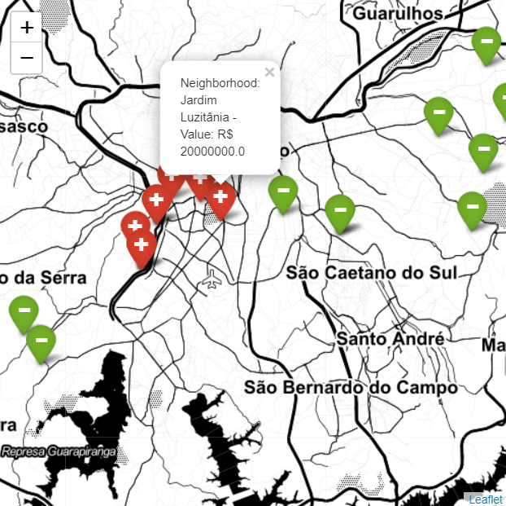

# São Paulo - Real Estate Analysis - Price Prediction 
## Marcos V. O. Assis (mvoassis@gmail.com)

***

* [Test the API - Simple WEB app calling GCP](https://docs.ufpr.br/~marcos.assis/price_pred_api.html) ***

> ## Objectives:

1.   Perform a descriptive analysis to generate insights about São Paulo's properties.
2.   Propose a regression model able to predict a property value based on its features, like Area (size), number of rooms, geographic location, and so on. 

> ## DataSets (Details on the 'Uploading Datasets' section):

1. 'Properties Dataset' - **House price data of Sao Paulo** (Kaggle)
2. 'IBGE Dataset' - **2010 Demographic Census Information Base: Universe Results by Census Sector** *(Base de informações do Censo Demográfico 2010: Resultados do Universo por setor censitário)*
3. 'Addresses Dataset' - **Address dataset of all brazilian states (UF)**
4. 'Geolocation Dataset' - **Mesh of Census Sectors - São Paulo** *(Malha de Setores Censitários IBGE - São Paulo)*

> ## Approach:

1. Perform a Descriptive Analysis of the 'Properties Dataset';
2. Merge 'Properties Dataset' and 'IBGE Dataset':
> * First, merge 'Properties Dataset' to 'Addresses Dataset' to add *latitude* and *longitude* features.
> * Create a geopandas Point feature on the dataset, containing coordinates of *latitude* and *longitude*.
> * Import 'Geolocation Dataset', and map the ID of Census Sectors: 'draw' the census sectors as polygons, and verify which coordinate point correspond to each address (latitude and longitude coordinates).
> * Finally, merge 'Properties Dataset' with 'IBGE Dataset', based on the Census Sector ID. 
3. Implement and test different Regression Algorithms to predict property Value based on different features sets.
4. Discussion and conclusions on the achieved results.
5. Implemented the prediction solution as an API, using Python and Flask.
6. Deployed the API to Google Cloud Platform (GCP), using Docker and Google Cloud Run.

> ## Files: 

* enderecos.csv - Address dataset file ([Download here](https://drive.google.com/file/d/1OBsHwS93BYs9LMFVlxnRIF2eiRXLbfTM/view?usp=sharing))
* 35SEE250GC_SIR.{dbf,prj,shp,shx} - SP Geolocation dataset (all files needed) ([Download here](https://drive.google.com/file/d/1dItDODXq7WYrY_5WVpMn7vcNsRu9Rt4p/view?usp=sharing))
* data_sale_censo.csv - Merged dataset (if you want to start running from 'Predicting Property Values' section)
* models - Folder containing the pickle files for Voting and Gradient Boosting trained models.
* src/app/main.py - API file
* Dockerfile
* requirements.txt

***

